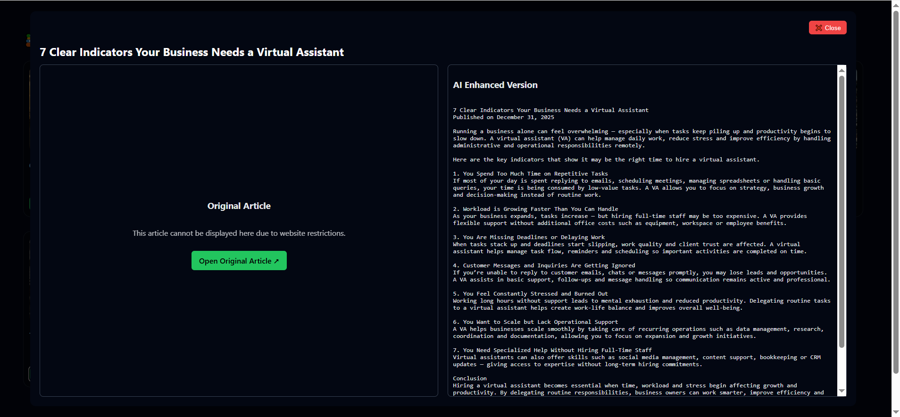

🚀 BeyondChats Assignment — Article Scraper, AI Rewriter & Frontend Viewer

This project implements all three phases of the BeyondChats Full-Stack assignment:
Scrapes the 5 oldest blog articles
Stores them in a database with CRUD APIs
Rewrites articles using AI + Google-ranked reference articles
Publishes updated versions
Displays original & updated articles in a React UI

🕸 Article Scraper • ⚙️ CRUD APIs • 🤖 AI Rewriter • 🎨 React Frontend Viewer

This project implements all three phases of the BeyondChats technical assignment, covering web scraping, backend APIs, AI-powered rewriting, and a full React UI to display original and AI-enhanced articles.
## 📸 Output Screenshots

🎯 Project Features
🟡 Phase-1 — Scrape, Store & CRUD APIs

Scrapes the 5 oldest articles from BeyondChats blog page

Stores articles in MongoDB Database

Provides RESTful CRUD APIs:

Create Article

Read / Fetch Articles

Update Article

Delete Article

🟢 Phase-2 — AI Rewrite + Google-Enhanced Content

Uses AI to rewrite articles in improved language

Adds contextual enhancements using Google references

Saves AI-generated version alongside original content

Publishes both versions in database

🟢 Phase-3 — React Frontend Viewer

React UI to display:

📄 Original Articles

✨ AI-Enhanced Articles

Toggle / Switch to compare both versions

Clean, minimal, user-friendly interface

🏗️ Tech Stack

Backend

Node.js

Express.js

MongoDB + Mongoose

AI & Utilities

OpenAI / LLM-based rewriting

Cheerio / Puppeteer (Web Scraping)

Frontend

React.js

Axios

Tailwind / CSS

📂 Project Structure
/backend
  ├── models/Article.js
  ├── routes/articleRoutes.js
  ├── scraper.js
  └── server.js

/frontend
  ├── src/components
  ├── src/pages
  └── App.js

🔧 How to Run the Project
▶️ Backend
cd backend
npm install
node server.js

▶️ Frontend
cd frontend
npm install
npm start
